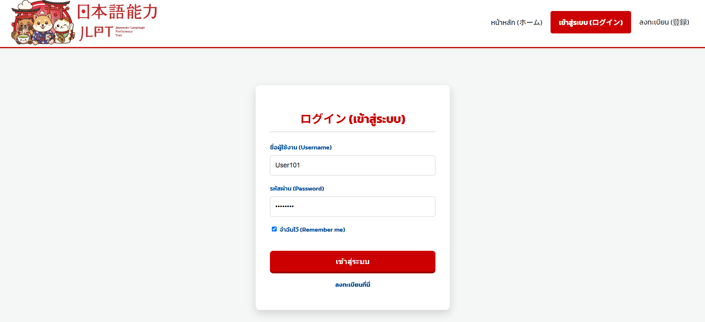
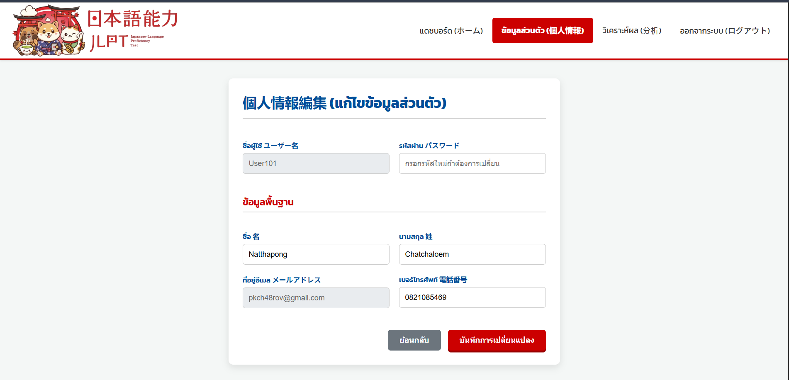
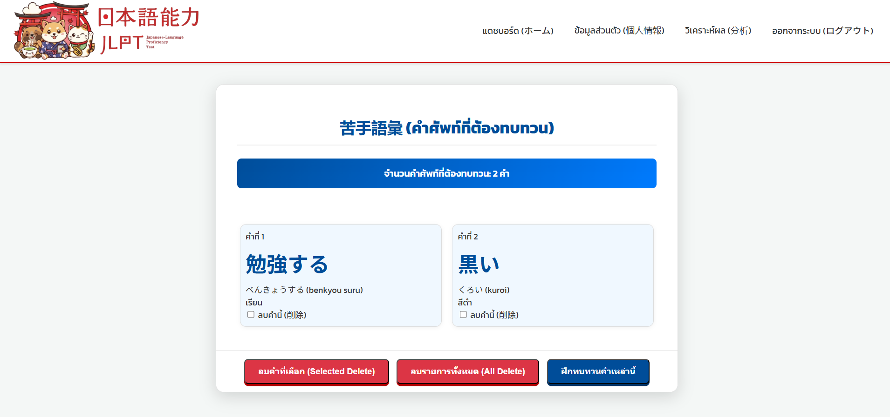
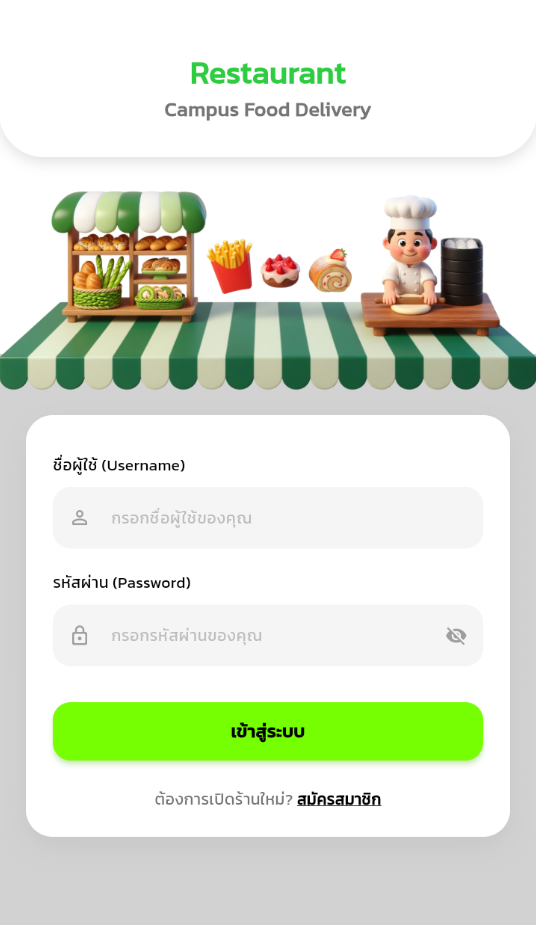
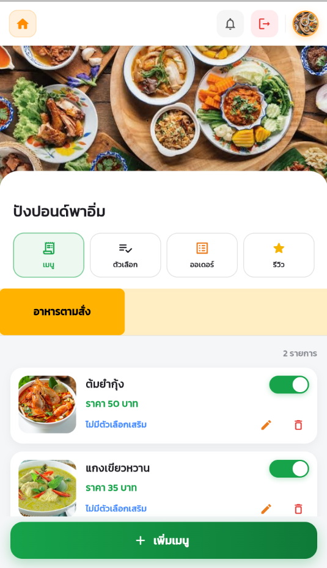

  

# ✧ N A R E E ✧
### IT Student of Maejo University

  <strong>Frontend Developer • UI/UX Enthusiast • Lifelong Learner</strong> 
  <em>“Crafting delightful, pixel-perfect, and engaging web experiences.”</em>

---

## 🚀 About Me
Fourth-year Information Technology student in the Faculty of Science at Maejo University, seeking a Frontend Developer internship. I have experience in building web applications with HTML, CSS, and JavaScript. I also built a mobile application for my senior project using Flutter and Dart. I focus on creating beautiful
and easy-to-use UI/UX for users. I am ready to learn real work in an organization and use my skills to do good quality work, learn continuously, and become a
valuable team member.
- 🌱 I'm currently learning Advanced Frontend Web Development 
- 🛠  Daily driver stack: Java, Spring Boot, JavaScript, HTML, CSS, Flutter, Dart  
- 🎯 Goal: Securing a Frontend Developer internship
- 📫 Reach me: 098579kl@gmail.com

---

## 🧰 Tech Stack & Tools

| Domain | Primary | Comfortable | Currently Exploring |
|:---:|:---:|:---:|:---:|
| **Front-end** |    | |   |
| **Back-end** |   | | |
| **Data** |  |  | |
| **Tools** |    |   |  |

---

## 📌 Featured Projects

| Project | Tech | Highlights | Links |
|---------|------|-----------|-------|
| **Campus food delivery** | Flutter · Java SpringBoot · PostgreSQL | Duo Project Mobile | [Repo](https://github.com/Naree17/campus-food-delivery) |
| **Japanese-Language Proficiency Test** | JSP · Java SpringBoot · MySQL | Duo Project Website | [Repo](https://github.com/Naree17/jlpt-web-project) |

### 🎌 Japanese-Language Proficiency Test (2025)

<table>
  <tr>
    <td width="33%" valign="top">
      <b>Page : Login</b> 
      
    </td>
    <td width="33%" valign="top">
      <b>Page : Edit Profile</b> 
      
    </td>
    <td width="34%" rowspan="2" valign="top">
      <b>📄 Overview</b> 
      A web application for simulating the JLPT exam, focusing on a clean, comfortable, and user-friendly UI/UX to help users study and review vocabulary efficiently.  
      <b>🙋‍♀️ My Role & Responsibilities</b> 
      <b>Role:</b> Full-Stack Developer 
      <b>Responsibilities:</b> Handled the end-to-end development of the Login, Edit Profile, and Vocabulary Practice sections.  
      <b>Programming Languages:</b> 
      
      
      
        
      <b>Tools:</b> Eclipse, MySQL Workbench
    </td>
  </tr>
  <tr>
    <td width="33%" valign="top">
      <b>Page : Vocabulary Practice sections</b> 
      
    </td>
    <td width="33%" valign="top">
      <!-- สามารถเพิ่มรูปที่ 4 ตรงนี้ได้ครับ หากไม่มีปล่อยว่างไว้ได้เลย -->
    </td>
  </tr>
</table>

 

### 🛵 Campus Food Delivery System (2025 - 2026)

<table>
  <tr>
    <td width="33%" valign="top">
      <b>Page : Restaurant Module</b> 
      
    </td>
    <td width="33%" valign="top">
      <b>Page : Admin Dashboard</b> 
      
    </td>
    <td width="34%" rowspan="2" valign="top">
      <b>📄 Overview</b> 
      An on-campus food ordering system created to provide an easy-to-use interface for students, university staff, merchants, and delivery riders.  
      <b>🙋‍♀️ My Role & Responsibilities</b> 
      <b>Role:</b> Full-Stack Developer 
      <b>Responsibilities:</b> Developed both frontend and backend systems for the Restaurant and Admin modules.  
      <b>Programming Languages:</b> 
      
      
      
        
      <b>Tools:</b> VS Code, IntelliJ IDEA, pgAdmin4, Postman
    </td>
  </tr>
  <tr>
    <td width="33%" valign="top">
      <!-- สามารถเพิ่มรูปที่ 3 ตรงนี้ได้ครับ -->
    </td>
    <td width="33%" valign="top">
      <!-- สามารถเพิ่มรูปที่ 4 ตรงนี้ได้ครับ -->
    </td>
  </tr>
</table>
---

## 📈 GitHub Stats

  
  

---

## 🤝 Let’s Connect
> **“Great products are built by great people working together.”**

- 💌 Email: 098579kl@gmail.com 
- 📝 Resume: [View Resume](https://drive.google.com/file/d/1LpuSi9iwIGE24b-ztPjWMuPsHQDaOvYa/view?usp=sharing)
- 🐦 Facebook: [Na Ree](https://www.facebook.com/naree.saeyang.12)

  

